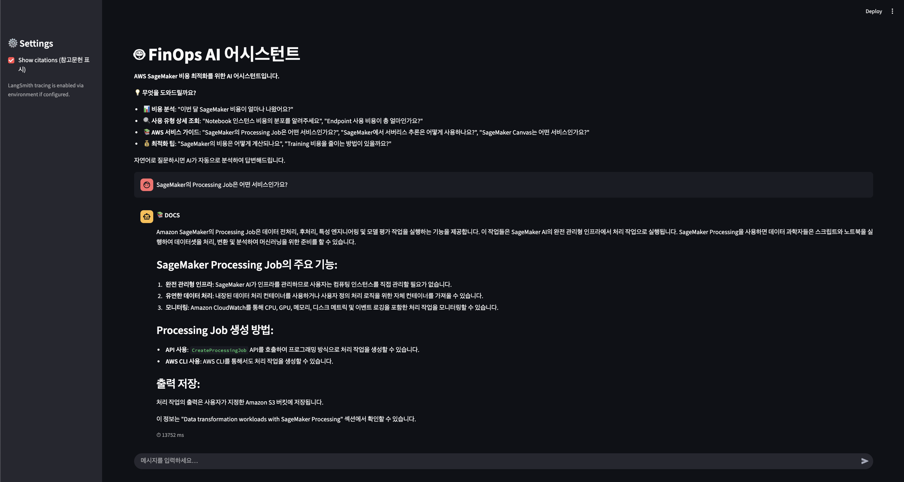
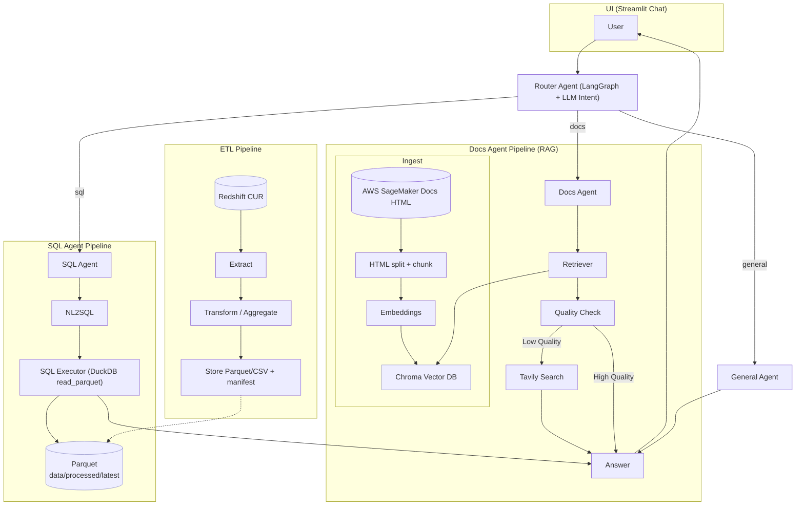

# 🚀 FinOps RAG Agent

AWS SageMaker 비용 분석을 위한 ETL 파이프라인과 RAG 기반 AI 에이전트입니다.
  

## 🎯 주요 시나리오

* 이번달 SageMaker 총비용 조회
* Endpoint 인스턴스 사용 시간 및 비용 조회
* Notebook 인스턴스의 사용 유형 분석
* Training Job의 Spot 비중과 고비용 Job 분석
* Inference Endpoint의 서버리스·멀티모델 전환 가능 후보 탐색
* 특정 계정의 태그 누락률과 코스트카테고리 미매핑 비용 파악
* 최근 3개월 비용 추이 및 스파이크 원인 분석
* SageMaker 서비스 설명과 공식 문서 기반 절감 방안 확인

## 🔑 기능

* Redshift CUR 추출 및 비용 데이터 집계
* LLM 기반 의도 분류 (SQL / Docs / General)
* SQL Agent: CUR 기반 비용 분석 쿼리
* Docs Agent: SageMaker 공식 문서 기반 RAG 검색
* General Agent: 일반 대화 및 안내
* Streamlit UI 제공

## ▶️ 실행

### ETL 파이프라인

```bash
python -m src.run_etl --billing-ym 202508 \
  --accounts 123456789101,112233445566
  # or contract id 
```

### Streamlit UI

```bash
streamlit run src/ui/app.py
```

## 📁 프로젝트 구조

```
finops-rag-agent/
├── src/agent/            # 에이전트 모듈
│   ├── docs_agent/       # 문서 기반 RAG
│   ├── sql_agent/        # SQL 분석
│   ├── general_agent/    # 일반 대화
│   └── router/           # 의도 분류 및 라우팅
├── src/etl/              # ETL 파이프라인
├── src/ui/               # Streamlit UI
├── data/                 # 데이터 저장소
└── README.md
```

## 📊 출력 데이터

* fact\_sagemaker\_costs: 원시 + 파생 컬럼
* agg\_endpoint\_hours, agg\_training\_cost, agg\_notebook\_hours: 리소스별 집계
* agg\_spot\_ratio: Spot vs OnDemand 비용 비율
* monthly\_summary: 월별 요약 통계

## 🏗 아키텍처

* Router Agent: LangGraph 기반 워크플로우, LLM 의도 분류
* SQL Agent: CUR 데이터 → NL2SQL 변환 및 실행
* Docs Agent: 공식 문서 수집·임베딩 → Chroma DB → RAG 검색
* General Agent: 인사, 도움말 등 일반 대화 처리
* ETL Pipeline: Redshift CUR 추출 → 변환·집계 → 저장
* UI: Streamlit 기반 채팅 인터페이스



## ⚙️ 핵심 기술

* LangGraph 상태 기반 라우팅 (prepare, route, dispatch)
* NL2SQL + 안전한 SQL 실행 + 결과 요약
* 문서 수집·청킹·임베딩 기반 Docs Agent
* Chroma DB + OpenAI 임베딩 기반 RAG
* 검색 최적화: 중복 제거, 유사도 임계값, 재순위화
* 모든 응답에 SQL 결과나 문서 인용 포함

